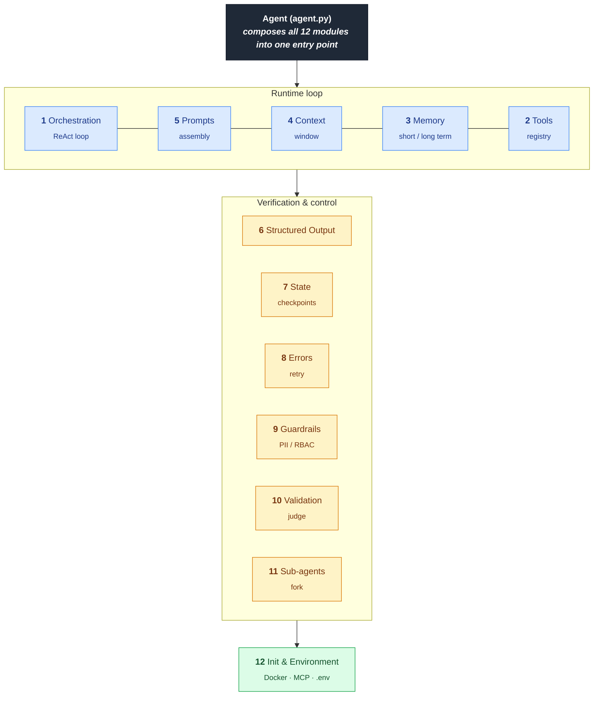

# Claude Agent Harness Template

A production-ready scaffold for building agentic AI applications with Claude. Structured around 12 modules that cover the full lifecycle of an autonomous agent: orchestration, tools, memory, context, prompting, structured output, state, errors, guardrails, validation, sub-agents, and environment.

## Quick Start

```bash
# 1. Clone and enter
git clone <your-fork> my-agent && cd my-agent

# 2. Install
pip install -e ".[dev]"

# 3. Configure
cp .env.example .env  # set ANTHROPIC_API_KEY

# 4. Run the example
python examples/basic_agent.py "Summarize the README.md and check that the package imports cleanly."
```

For a sandboxed run:

```bash
docker compose run --rm agent python examples/basic_agent.py "your task here"
```

## The 12 Modules

| # | Module | Path | Purpose |
|---|---|---|---|
| 1 | Orchestration Loop | `src/harness/orchestration/` | ReAct loop, parallel tool execution, FSM for deterministic workflows |
| 2 | Tooling Layer | `src/harness/tools/` | Pydantic-validated tool registry, OpenAPI-style schemas, native Claude function calling |
| 3 | Memory System | `src/harness/memory/` | Short-term (in-process / Redis) + long-term (vector store interface) |
| 4 | Context Management | `src/harness/context/` | Summarization, lost-in-the-middle mitigation, observation masking |
| 5 | Prompt Assembly | `src/harness/prompts/` | Jinja2 templates, few-shot injection, system prompt builder |
| 6 | Structured Output | `src/harness/output/` | Pydantic models via `messages.parse()`, JSON-schema fallback, regex extraction |
| 7 | State & Checkpoints | `src/harness/state/` | SQLite checkpointer, git-based snapshots, time-travel debugging |
| 8 | Error Handling | `src/harness/errors/` | Exponential backoff, error classification, self-correction loop |
| 9 | Guardrails | `src/harness/guardrails/` | Input/output filters, PII scrubbing, RBAC tool gating |
| 10 | Validation & Feedback | `src/harness/validation/` | Pytest/lint runners, Judge LLM, Playwright hook |
| 11 | Sub-Agent Orchestration | `src/harness/subagents/` | Fork, handoff, teammate-mode coordinator |
| 12 | Init & Environment | `src/harness/env/` | Docker sandbox, MCP wiring, env var loading |

Each module is a self-contained package with a small, opinionated public API. See `src/harness/<module>/__init__.py` for what each exposes.

## Architecture



The `Agent` class in `src/harness/agent.py` wires every module together. To customize, replace any single module — they don't depend on each other's internals, only their public interfaces.

> **Diagram convention:** All diagrams in this repo are authored in [Mermaid](https://mermaid.js.org/). GitHub, VS Code, and most modern Markdown renderers display them natively — keep new diagrams in `mermaid` fenced code blocks rather than ASCII art or external images.

## Configuration

All runtime config flows through `src/harness/config.py`, which reads from `.env` via `pydantic-settings`. The defaults target Claude Opus 4.7 with adaptive thinking enabled.

| Variable | Default | Purpose |
|---|---|---|
| `ANTHROPIC_API_KEY` | — | Required |
| `HARNESS_MODEL` | `claude-opus-4-7` | Primary model |
| `HARNESS_JUDGE_MODEL` | `claude-sonnet-4-6` | Judge LLM (cheaper) |
| `HARNESS_SUBAGENT_MODEL` | `claude-haiku-4-5` | Subagent model |
| `HARNESS_MAX_TOKENS` | `16000` | Per-turn output cap |
| `HARNESS_EFFORT` | `high` | `low` \| `medium` \| `high` \| `xhigh` \| `max` |
| `HARNESS_CHECKPOINT_DB` | `./.harness/checkpoints.db` | SQLite path |
| `HARNESS_LOG_LEVEL` | `INFO` | Python log level |
| `REDIS_URL` | unset | Optional, enables Redis short-term memory |
| `VECTOR_DB_URL` | unset | Optional, long-term memory backend |

## Development

```bash
pytest                        # run tests
ruff check src tests          # lint
ruff format src tests         # format
mypy src                      # type check
```

## Extending

The most common extension points:

- **Add a tool** — drop a function decorated with `@tool` in `src/harness/tools/builtin.py` (or any module that calls `register_tool`).
- **Swap memory backends** — implement `LongTermMemory` interface in `src/harness/memory/long_term.py`.
- **Add a guardrail** — subclass `Guardrail` in `src/harness/guardrails/filters.py`.
- **Custom validation** — implement `Validator` in `src/harness/validation/judge.py`.

## License

See `LICENSE`.
